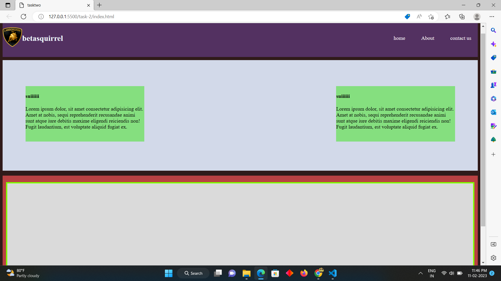
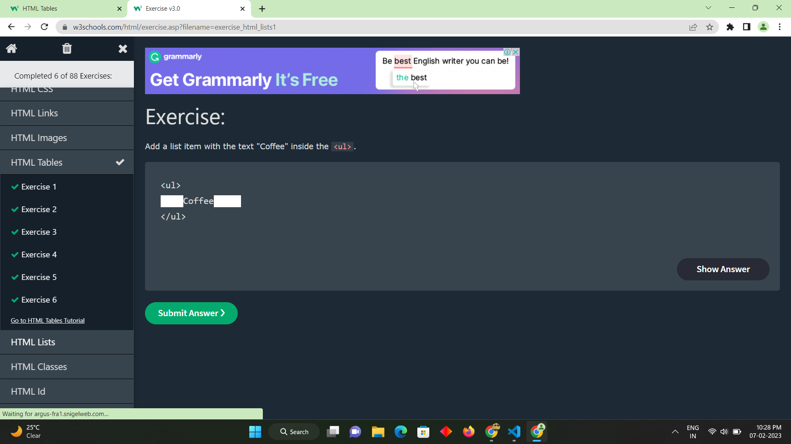

# betasquirrel-task

tasks from betasquirrel

## Demo-website

- [live](https://mohamedaslam-e.github.io/betasquirrel-task/)

## Accounts

- [Linkedln](www.linkedin.com/in/mohamed-aslam-631065245)
- [stackoverflow](https://stackoverflow.com/users/21194385/mohamed-aslam)

## Task

| Requirments                        | output                          |
| ---------------------------------  | --------------------------------|
|    |   |
|    |   |
|    |  |

## linux commands

- `cd` - change current directory. ex:`cd Desktop`,`cd ..`
- `ls` - list contents of a directory,Ex: `ls -a` lists hidden files as well.
- `pwd` - Display current working directory path.
- `cat` - Display contents of a file Ex: `cat README.md`
- `mkdir` - to creat a new folder using github bash.
- `cd ..` - change back to previous current directory path
- `rm` - The rm command is used to remove a file. EX: `rm filename`
- `clear` - To clear the screen EX:`clear` 

## Git commands

1.`git config` Config git user. EX:` git config --global user.name "MohamedAslam-E"`, `git config user.email "aslamnjr007@gmail.com"`

2.`git clone` clone a remote git repositery to your local. Ex:` git clone "add user https link or ssh key"`

3.`git add `Add your file changes to git. Ex: `git add . `: this will add all file to the repo` git add README.md `: this will add the readme file we can specify using the file name

4.`git commit `commit changes to git. `git commit -m "Initial commit"`

5.`git push`push your local commits to remote repo Ex:`git push origin   main`

6.`git reset` This command undoes all the commits after the specified commit and preserves the changes locally.

7.`git pull` This command fetches and merges changes on the remote server to your working directory.
8.`git diff` - see the changes on each file
9.`git log` - see commit history
10.`git stash` - stash your uncommitted changes
11.`git status` - to see the current changes as list

## Reading tasks

- [Home](https://www.w3schools.com/html/default.asp)
- [Introduction](https://www.w3schools.com/html/html_intro.asp)
- [Editors](https://www.w3schools.com/html/html_editors.asp)
- [Basics](https://www.w3schools.com/html/html_basic.asp)
- [Elements](https://www.w3schools.com/html/html_elements.asp)
- [Attributes](https://www.w3schools.com/html/html_attributes.asp)
- [Heading](https://www.w3schools.com/html/html_headings.asp)
- [Paragraph](https://www.w3schools.com/html/html_paragraphs.asp)
- [Styles](https://www.w3schools.com/html/html_styles.asp)
- [Formatting](https://www.w3schools.com/html/html_formatting.asp)
- [Quatation](https://www.w3schools.com/html/html_quotation_elements.asp)
- [Comments](https://www.w3schools.com/html/html_comments.asp)
- [Colors](https://www.w3schools.com/html/html_colors.asp)
- [Css](https://www.w3schools.com/html/html_css.asp)
- [Links](https://www.w3schools.com/html/html_links.asp)
- [Images](https://www.w3schools.com/html/html_images.asp)
- [Favicon](https://www.w3schools.com/html/html_favicon.asp)
- [Tables](https://www.w3schools.com/html/html_tables.asp)
- [classes](https://www.w3schools.com/html/html_classes.asp)
- [id](https://www.w3schools.com/html/html_id.asp)
- [Tables](https://www.w3schools.com/html/html_tables.asp)

 ## Exercise

 

 